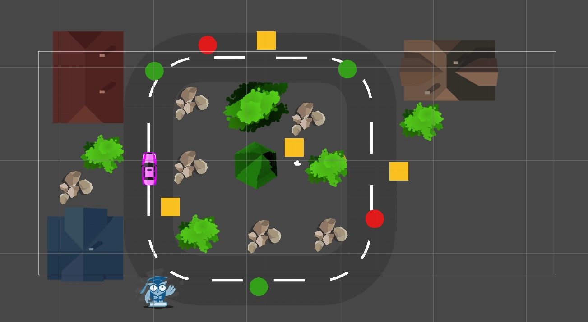

# Delivery Driver Game

A simple game about a delivery driver picking up packages and delivering them to our friend "Olwie". 

## Main Features

- The player can navigate in our world 
- The player can pick up packages
- There are Speed Boosts and Speed Bumps

## Demo

- [Play this game now!](https://play.unity.com/mg/other/delivery_driver-game_webgl_build)

## References

 - [Complete C# Unity Game Developer 2D](https://www.udemy.com/course/unitycourse/)
 - [Unity User Manual](https://docs.unity3d.com/Manual/index.html)
 - [C# Programming Guide](https://docs.microsoft.com/en-us/dotnet/csharp/programming-guide/)

## Feedback

If you have any feedback, please reach out to me on my socials.

 

## 🔗 Links

